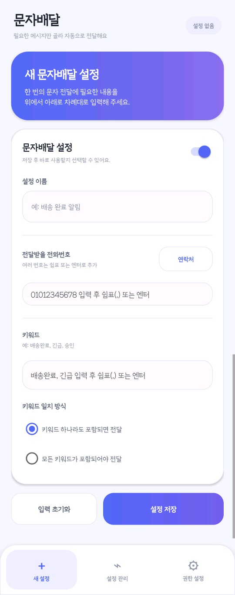
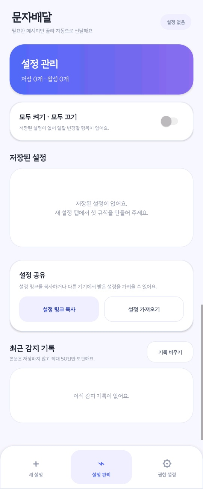
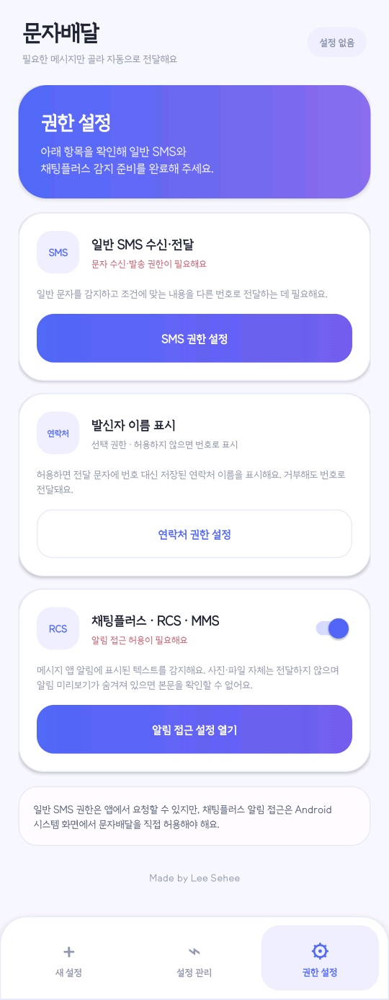
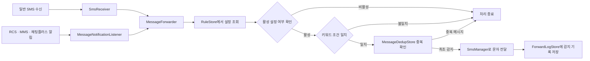

<div align="center">

# 📨 문자배달

**필요한 메시지만 골라 지정한 번호로 자동 전달하는 네이티브 Android 앱**


</div>

---

## 프로젝트 소개

**문자배달**은 일반 SMS와 메시지 앱 알림에서 사용자가 등록한 키워드를 감지한 뒤, 조건에 맞는 메시지만 지정된 전화번호로 자동 전달하는 Android 애플리케이션입니다.

여러 개의 전달 번호와 키워드를 하나의 설정으로 관리할 수 있으며, 일반 SMS뿐 아니라 삼성 메시지·Google 메시지 등에서 수신한 채팅플러스(RCS)와 MMS의 알림 텍스트도 보조적으로 감지합니다.

모든 설정과 감지 기록은 기기 내부에만 저장되며, 별도의 회원가입·서버·원격 관리 기능은 사용하지 않습니다.

---

## 화면 구성

<table>
  <tr>
    <td align="center">
      
    </td>
    <td align="center">
      
    </td>
    <td align="center">
      
    </td>
  </tr>
  <tr>
    <td align="center"><b>새 설정</b></td>
    <td align="center"><b>설정 관리</b></td>
    <td align="center"><b>권한 설정</b></td>
  </tr>
</table>

### 새 설정

한 화면에서 문자 자동 전달에 필요한 조건을 순서대로 등록할 수 있습니다.

- 설정 이름 입력
- 전달받을 전화번호 여러 개 등록
- 감지할 키워드 여러 개 등록
- 키워드 하나라도 포함 또는 모든 키워드 포함 방식 선택
- 설정별 활성화·비활성화
- 입력 초기화 및 저장
- 연락처에서 전달 번호 선택

설정 이름을 입력하지 않으면 첫 번째 키워드를 기준으로 `#키워드 문자배달` 형식의 이름이 자동 생성됩니다.

저장 후에는 새 설정 화면을 유지하면서 입력값만 초기화되어 다음 설정을 바로 추가할 수 있습니다.

### 설정 관리

저장한 문자 전달 설정과 최근 감지 기록을 관리하는 화면입니다.

- 저장된 설정 조회
- 저장된 설정 수정 및 삭제
- 설정별 개별 ON/OFF
- 모든 설정 일괄 켜기·끄기
- 저장된 설정 개수 표시
- 활성 설정 개수 표시
- 설정 링크 복사
- 다른 기기에서 설정 가져오기
- 중복 설정 자동 제외
- 최근 감지 기록 확인
- 최근 감지 기록 삭제

### 권한 설정

문자 감지와 전달에 필요한 Android 권한을 확인하고 설정할 수 있습니다.

- 일반 SMS 수신 권한 요청
- 일반 SMS 발송 권한 요청
- 연락처 이름 표시 권한 요청
- 채팅플러스·RCS·MMS 알림 감지 기능 ON/OFF
- Android 알림 접근 설정 화면 연결
- 권한별 현재 상태 표시

---

## 주요 기능

### 1. 키워드 기반 메시지 자동 전달

수신한 메시지 본문을 저장된 규칙과 비교하여 조건이 일치할 때만 지정된 번호로 전달합니다.

영문 키워드는 대소문자를 구분하지 않습니다.

#### 키워드 하나라도 포함

등록한 키워드 중 한 개 이상 포함되면 메시지를 전달합니다.

```text
등록 키워드
- 배송완료
- 도착
- 배달

수신 메시지
- 고객님의 상품이 배송완료되었습니다.

결과
- 전달 실행
```

#### 모든 키워드 포함

등록한 모든 키워드가 메시지에 포함되어야 전달합니다.

```text
등록 키워드
- 긴급
- 승인

수신 메시지
- 긴급 승인이 필요합니다.

결과
- 전달 실행
```

---

### 2. 여러 전달 번호 지원

하나의 설정에 여러 개의 전달 번호를 등록할 수 있습니다.

전화번호 입력 후 쉼표 또는 엔터를 입력하면 번호가 개별 항목으로 등록됩니다.

```text
01012345678
01098765432
01055554444
```

조건과 일치하는 문자가 감지되면 등록된 번호에 각각 메시지를 전달합니다.

---

### 3. 여러 키워드 지원

하나의 설정에 여러 개의 키워드를 등록할 수 있습니다.

키워드 입력 후 쉼표 또는 엔터를 입력하면 각각 개별 키워드로 등록됩니다.

```text
배송완료
긴급
승인
도착
```

---

### 4. 여러 설정 관리

용도에 따라 문자 전달 규칙을 여러 개 만들어 관리할 수 있습니다.

```text
배송 완료 알림
긴급 승인 알림
택배 도착 알림
업무 문자 전달
```

각 설정은 개별적으로 활성화하거나 비활성화할 수 있습니다.

---

### 5. 일반 SMS 직접 감지

`SmsReceiver`가 Android의 `SMS_RECEIVED` 방송을 수신합니다.

분할 수신된 SMS가 있는 경우 여러 개의 메시지 조각을 하나의 본문으로 합친 뒤 저장된 설정과 비교합니다.

```text
SMS 수신
→ 메시지 본문 결합
→ 활성 설정 조회
→ 키워드 조건 확인
→ 전달 여부 결정
```

---

### 6. 채팅플러스·RCS·MMS 알림 보조 감지

`MessageNotificationListener`가 메시지 애플리케이션의 알림을 읽어 발신자와 최신 텍스트를 추출합니다.

현재 코드에서 우선적으로 인식하는 메시지 앱은 다음과 같습니다.

- 삼성 메시지
- Google 메시지
- Android 기본 메시지 앱
- Android 기본 MMS 앱
- LG 계열 메시지 앱
- Sony 계열 메시지 앱
- HTC 계열 메시지 앱

패키지명에 다음 문자열이 포함된 앱도 보조적으로 판별합니다.

```text
message
messaging
mms
```

채팅플러스·RCS·MMS는 실제 메시지 데이터가 아닌 알림에 표시된 텍스트를 기반으로 감지합니다.

---

### 7. 중복 전달 방지

일반 SMS 수신 경로와 메시지 앱 알림 경로가 동일한 메시지를 동시에 감지할 수 있습니다.

`MessageDedupStore`는 메시지 본문과 발신자 정보를 비교하여 같은 메시지가 두 번 전달되지 않도록 방지합니다.

- 중복 판정 시간: 약 45초
- 최근 중복 판정 데이터: 최대 24건
- 동일 메시지 중복 발송 방지
- SMS와 알림 동시 감지 대응

---

### 8. 설정 공유 및 가져오기

저장된 설정을 링크 형태로 복사하여 다른 기기나 사용자에게 공유할 수 있습니다.

```text
smsforwarder://import?v=3&data=...
```

링크 내부에는 설정 정보를 변환한 JSON 데이터가 포함됩니다.

앱에서 설정 링크 또는 JSON 데이터를 붙여 넣으면 다음 정보를 가져옵니다.

- 설정 이름
- 전달 번호
- 키워드
- 키워드 일치 방식
- 설정 활성화 상태

설정 이름, 전달 번호, 키워드, 일치 방식이 동일한 설정은 중복으로 추가하지 않습니다.

---

### 9. 최근 감지 기록

문자 전달 요청이 발생하면 최근 감지 기록을 기기 내부에 저장합니다.

최대 50건까지 보관되며, 오래된 기록부터 자동으로 삭제됩니다.

저장되는 정보는 다음과 같습니다.

- 감지 시각
- 적용된 설정 이름
- 감지 경로
- 일부 마스킹된 발신자 정보
- 일치한 키워드
- 전달 대상 수

**문자 메시지 본문은 최근 기록에 저장하지 않습니다.**

---

### 10. 발신자 연락처 이름 표시

연락처 권한이 허용되어 있고 발신 번호가 기기에 저장되어 있으면 전달 메시지에 전화번호 대신 연락처 이름을 표시합니다.

연락처 권한이 없거나 저장된 연락처를 찾지 못하면 원본 전화번호를 표시합니다.

```text
[ 홍길동 ]
문자 내용
```

또는

```text
[ 01012345678 ]
문자 내용
```

---

## 메시지 전달 형식

전달되는 문자는 다음 형식으로 구성됩니다.

```text
[ 발신자 이름 또는 번호 ]
문자 내용
```

예시:

```text
[ CJ대한통운 ]
고객님의 상품이 배송완료되었습니다.
```

연락처 권한이 허용되어 있고 발신 번호가 기기에 저장되어 있으면 연락처 이름을 표시합니다.

이름을 찾을 수 없거나 권한이 없는 경우 원본 번호 또는 메시지 알림에서 추출한 발신자명을 사용합니다.

---

## 동작 구조



---

## 핵심 클래스

| 클래스 | 역할 |
|---|---|
| `MainActivity` | 새 설정, 설정 관리, 권한 설정으로 구성된 메인 화면 처리 |
| `Rule` | 설정 데이터와 키워드 일치 로직 정의 |
| `RuleStore` | `SharedPreferences` 기반 설정 저장, 불러오기 및 마이그레이션 |
| `SmsReceiver` | 일반 SMS 수신 및 분할된 문자 본문 결합 |
| `MessageNotificationListener` | 메시지 앱 알림에서 발신자와 최신 본문 추출 |
| `MessageForwarder` | 일치 규칙 확인, 연락처 이름 조회 및 SMS 전달 실행 |
| `MessageDedupStore` | SMS와 알림의 이중 감지로 인한 중복 전달 방지 |
| `ForwardLogStore` | 본문을 제외한 최근 감지 기록 최대 50건 저장 |
| `TagInputView` | 전화번호와 키워드를 태그 형태로 입력하고 삭제하는 커스텀 뷰 |
| `FlowLayout` | 키워드와 전화번호 항목을 자동 줄바꿈하여 배치하는 커스텀 레이아웃 |
| `NotificationAccessUtils` | 알림 접근 권한 상태 확인 및 Android 시스템 설정 이동 |
| `BuildSeal` | 공식 서명 여부 확인 및 비공식 빌드 표시 |

---

## 기술 스택

| 구분 | 내용 |
|---|---|
| Platform | Android Native |
| Language | Java 8 소스 호환 |
| UI | Android XML Layout, Custom View |
| Local Storage | `SharedPreferences`, JSON |
| Build Tool | Gradle 8.7 |
| Android Gradle Plugin | 8.5.2 |
| compileSdk | 35 |
| targetSdk | 35 |
| minSdk | 23 |
| 외부 라이브러리 | 없음 |

---

## 권한 안내

| 권한 | 필수 여부 | 사용 목적 |
|---|---:|---|
| `RECEIVE_SMS` | 필수 | 일반 SMS 수신 감지 |
| `SEND_SMS` | 필수 | 조건이 일치한 메시지 자동 전달 |
| `READ_CONTACTS` | 선택 | 발신 번호 대신 저장된 연락처 이름 표시 |
| 알림 접근 권한 | RCS·MMS 감지 시 필수 | 메시지 앱 알림의 발신자와 텍스트 읽기 |

일반 SMS 권한은 앱에서 직접 요청할 수 있지만, 알림 접근 권한은 Android 시스템 설정에서 사용자가 직접 허용해야 합니다.

---

## 설치 및 실행

### Android Studio에서 실행

1. 프로젝트 압축을 해제합니다.
2. Android Studio를 실행합니다.
3. `KeywordSmsDelivery` 프로젝트 폴더를 엽니다.
4. Gradle Sync가 완료될 때까지 기다립니다.
5. SMS 기능을 사용할 수 있는 실제 Android 기기를 연결합니다.
6. 앱을 빌드하고 실행합니다.
7. 앱 하단의 `권한 설정` 탭으로 이동합니다.
8. SMS 수신·발송 권한을 허용합니다.
9. 필요한 경우 연락처 권한을 허용합니다.
10. 채팅플러스·RCS·MMS 감지를 사용할 경우 알림 접근 권한을 허용합니다.

SMS 수신과 발송 기능은 Android 에뮬레이터보다 실제 통신이 가능한 Android 기기에서 테스트하는 것이 적합합니다.

---

## 디버그 APK 빌드

### Windows

```bash
.\gradlew.bat assembleDebug
```

### macOS / Linux

```bash
./gradlew assembleDebug
```

빌드 결과물은 다음 위치에 생성됩니다.

```text
app/build/outputs/apk/debug/app-debug.apk
```

---

## 디버그 AAB 빌드

### Windows

```bash
.\gradlew.bat bundleDebug
```

### macOS / Linux

```bash
./gradlew bundleDebug
```

빌드 결과물은 다음 위치에 생성됩니다.

```text
app/build/outputs/bundle/debug/app-debug.aab
```

서명된 Release AAB는 Android Studio에서 다음 메뉴를 통해 생성할 수 있습니다.

```text
Build
→ Generate Signed Bundle / APK
→ Android App Bundle
```

서명키와 비밀번호 파일은 GitHub 저장소에 업로드하거나 커밋하지 않아야 합니다.

---

## 프로젝트 구조

```text
KeywordSmsDelivery/
├─ app/
│  ├─ build.gradle
│  ├─ proguard-rules.pro
│  └─ src/main/
│     ├─ AndroidManifest.xml
│     ├─ java/com/example/keywordsmsforwarder/
│     │  ├─ MainActivity.java
│     │  ├─ Rule.java
│     │  ├─ RuleStore.java
│     │  ├─ SmsReceiver.java
│     │  ├─ MessageNotificationListener.java
│     │  ├─ MessageForwarder.java
│     │  ├─ MessageDedupStore.java
│     │  ├─ ForwardLogStore.java
│     │  ├─ TagInputView.java
│     │  ├─ FlowLayout.java
│     │  ├─ NotificationAccessUtils.java
│     │  └─ BuildSeal.java
│     └─ res/
│        ├─ drawable/
│        ├─ layout/
│        │  ├─ activity_main.xml
│        │  ├─ tab_create.xml
│        │  ├─ tab_manage.xml
│        │  ├─ tab_settings.xml
│        │  └─ item_rule_manage.xml
│        └─ values/
├─ AAB_BUILD_GUIDE.md
├─ CHANGELOG.md
├─ TEST_CHECKLIST.md
├─ LICENSE
├─ NOTICE
└─ README.md
```

---

## 개인정보 및 보안

문자배달은 별도의 서버 없이 기기 내부에서 동작하도록 구성되어 있습니다.

- 설정과 감지 기록은 Android `SharedPreferences`에 저장됩니다.
- 서버 전송 기능이 포함되어 있지 않습니다.
- 회원가입과 로그인 기능이 없습니다.
- 원격 관리 기능이 없습니다.
- 사용자 분석 SDK가 포함되어 있지 않습니다.
- Android Manifest에 인터넷 권한을 선언하지 않습니다.
- 최근 감지 기록에는 메시지 본문을 저장하지 않습니다.
- 발신자 정보는 마지막 일부만 남기고 마스킹합니다.
- `android:allowBackup="false"`가 적용되어 있습니다.
- Release 빌드는 코드 난독화와 리소스 축소가 활성화되어 있습니다.
- 공식 배포 서명과 다른 키로 빌드하면 화면 하단에 `Unofficial build`가 표시됩니다.

---

## 사용 시 주의사항

- 채팅플러스·RCS·MMS는 메시지 원문이 아니라 **알림에 표시된 텍스트**를 감지합니다.
- 메시지 앱의 알림 미리보기가 꺼져 있으면 본문을 읽지 못할 수 있습니다.
- 사진, 영상, 파일 자체는 전달하지 않습니다.
- 알림에 표시된 텍스트만 처리합니다.
- Android 보안 정책에 따라 인증번호 등 일부 내용이 가려질 수 있습니다.
- 메시지 앱 업데이트로 알림 구조가 변경되면 감지가 제한될 수 있습니다.
- 자동 전달 과정에서 SMS 발송 요금이 발생할 수 있습니다.
- 실제 SMS 송수신 테스트는 통신 기능이 있는 실기기에서 진행하는 것이 적합합니다.
- 일부 제조사 기기에서는 배터리 최적화 설정으로 인해 백그라운드 감지가 제한될 수 있습니다.

---

## 버전 정보

### v3.4.2

- Android App Bundle 빌드 구성 추가
- `targetSdk 35` 적용
- `versionCode 12` 적용
- `versionName 3.4.2` 적용
- Release 난독화 환경에서 커스텀 입력 화면 종료 문제 수정
- 일반 SMS와 메시지 앱 알림의 중복 전달 방지 강화
- 누적 알림 대신 가장 최근 메시지를 우선 감지
- 발신자 조건 입력 및 필터 로직 제거
- 제작자 표시 적용
- 공식 서명 확인 기능 적용
- 서명 관련 파일 Git 제외 설정 추가

---

## 라이선스 및 제작자 표시

이 프로젝트는 저장소의 `LICENSE`와 `NOTICE` 조건을 따릅니다.

- 원본 디자인 및 구현: **Lee Sehee**
- 재배포 및 수정 버전에서도 앱 내 제작자 표시를 유지해야 합니다.
- 소스 배포 시 `NOTICE` 파일을 포함해야 합니다.
- 원본 서명키가 아닌 키로 빌드한 버전을 공식 릴리스로 표시해서는 안 됩니다.
- 소프트웨어는 별도의 보증 없이 제공됩니다.
